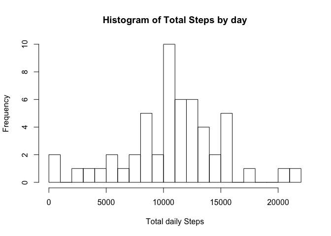
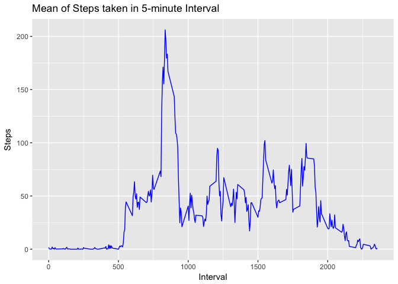
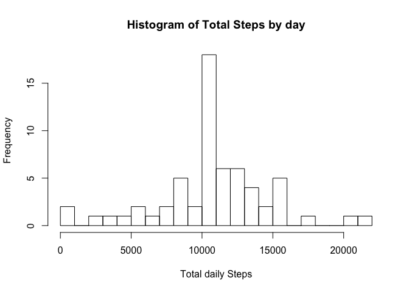
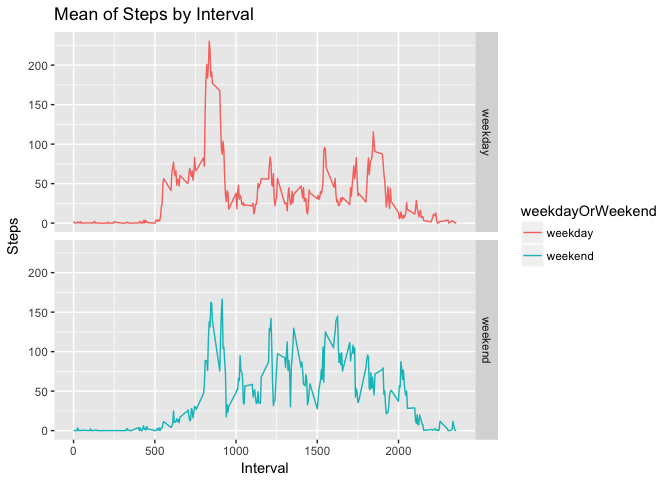

## Loading and preprocessing the data

1. Load the data


```r
unzip("activity.zip")

activityData <- read.csv("activity.csv")
head(activityData)
```

```
##   steps       date interval
## 1    NA 2012-10-01        0
## 2    NA 2012-10-01        5
## 3    NA 2012-10-01       10
## 4    NA 2012-10-01       15
## 5    NA 2012-10-01       20
## 6    NA 2012-10-01       25
```

2. Process/transform the data (if necessary) into a format suitable for your analysis


```r
activityData$date <- as.Date(as.character(activityData$date))
```

## What is mean total number of steps taken per day?

1. Calculate the total number of steps taken per day


```r
totalStepsByDay <- aggregate(steps ~ date, activityData, sum)
head(totalStepsByDay)
```

```
##         date steps
## 1 2012-10-02   126
## 2 2012-10-03 11352
## 3 2012-10-04 12116
## 4 2012-10-05 13294
## 5 2012-10-06 15420
## 6 2012-10-07 11015
```

2. Make a histogram of the total number of steps taken each day


```r
hist(totalStepsByDay$steps, xlab = "Total daily Steps",main="Histogram of Total Steps by day", breaks = 20)
```

<!-- -->

3. Calculate and report the mean and median of the total number of steps taken per day

Mean of total number of steps taken per day is:


```r
mean(totalStepsByDay$steps,na.rm=TRUE)
```

```
## [1] 10766.19
```

Median of total number of steps taken per day is:


```r
median(totalStepsByDay$steps,na.rm=TRUE)
```

```
## [1] 10765
```

## What is the average daily activity pattern?

1. Make a time series plot (i.e. 𝚝𝚢𝚙𝚎 = "𝚕") of the 5-minute interval (x-axis) and the average number of steps taken, averaged across all days (y-axis)


```r
library(ggplot2)
meanStepsTakenByInterval <- aggregate(steps ~ interval, activityData, mean)
ggplot(meanStepsTakenByInterval, aes(x = interval, y=steps)) +
  labs(title = "Mean of Steps taken in 5-minute Interval", x = "Interval", y = "Steps" ) +
  geom_line(color="blue")
```

<!-- -->

2. Which 5-minute interval, on average across all the days in the dataset, contains the maximum number of steps?


```r
maxInterval <- meanStepsTakenByInterval[which.max(meanStepsTakenByInterval$steps),]
maxInterval
```

```
##     interval    steps
## 104      835 206.1698
```

## Imputing missing values

1. Calculate and report the total number of missing values in the dataset (i.e. the total number of rows with NAs)


```r
sapply(activityData, function(x) sum(is.na(x)))
```

```
##    steps     date interval 
##     2304        0        0
```

2. Devise a strategy for filling in all of the missing values in the dataset.

Strategy: Use mean of 5-minute interval to replace missing values

3. Create a new dataset that is equal to the original dataset but with the missing data filled in.


```r
library(dplyr)
impute <- function(x) replace(x, is.na(x), mean(x, na.rm = TRUE))
imputedData <- activityData %>% group_by(interval) %>% mutate(steps= impute(steps))
head(imputedData)
```

```
## # A tibble: 6 x 3
## # Groups:   interval [6]
##    steps date       interval
##    <dbl> <date>        <int>
## 1 1.72   2012-10-01        0
## 2 0.340  2012-10-01        5
## 3 0.132  2012-10-01       10
## 4 0.151  2012-10-01       15
## 5 0.0755 2012-10-01       20
## 6 2.09   2012-10-01       25
```

4. Make a histogram of the total number of steps taken each day and Calculate and report the mean and median total number of steps taken per day. Do these values differ from the estimates from the first part of the assignment? What is the impact of imputing missing data on the estimates of the total daily number of steps?


```r
totalStepsByDay2 <- aggregate(steps ~ date, imputedData, sum)
hist(totalStepsByDay2$steps, xlab = "Total daily Steps",main="Histogram of Total Steps by day", breaks = 20)
```

<!-- -->

Mean of total number of steps taken per day is:


```r
mean(totalStepsByDay2$steps,na.rm=TRUE)
```

```
## [1] 10766.19
```

Median of total number of steps taken per day is:


```r
median(totalStepsByDay2$steps,na.rm=TRUE)
```

```
## [1] 10766.19
```

These values differ from the estimates in the first part of the assignment. The mean remains unchanged, but median has increased by 1.1886792.

The impact of imputing missing data is to align the median towards the mean.

## Are there differences in activity patterns between weekdays and weekends?

1. Create a new factor variable in the dataset with two levels – “weekday” and “weekend” indicating whether a given date is a weekday or weekend day.


```r
imputedData$dayofweek = weekdays(imputedData$date)
imputedData <- mutate(imputedData, weekdayOrWeekend = as.factor(ifelse(dayofweek  == "Sunday" | dayofweek  == "Saturday", "weekend", "weekday")))
head(imputedData)
```

```
## # A tibble: 6 x 5
## # Groups:   interval [6]
##    steps date       interval dayofweek weekdayOrWeekend
##    <dbl> <date>        <int> <chr>     <fct>           
## 1 1.72   2012-10-01        0 Monday    weekday         
## 2 0.340  2012-10-01        5 Monday    weekday         
## 3 0.132  2012-10-01       10 Monday    weekday         
## 4 0.151  2012-10-01       15 Monday    weekday         
## 5 0.0755 2012-10-01       20 Monday    weekday         
## 6 2.09   2012-10-01       25 Monday    weekday
```

2. Make a panel plot containing a time series plot (i.e. 𝚝𝚢𝚙𝚎 = "𝚕") of the 5-minute interval (x-axis) and the average number of steps taken, averaged across all weekday days or weekend days (y-axis).


```r
meandataByWeekendWeekday <- aggregate(steps ~ weekdayOrWeekend + interval, imputedData, mean)
ggplot(meandataByWeekendWeekday, aes(x = interval, y = steps, color = weekdayOrWeekend)) +
  geom_line() +
  facet_grid(weekdayOrWeekend ~ .) +
  labs(title = "Mean of Steps by Interval", x = "Interval", y = "Steps")
```

<!-- -->

There are differences in activity patterns between weekdays and weekends. There is a variation in number of steps at the beginning of weekdays, likely due to travel and workplace activities. There are more steps recorded during weekends.
